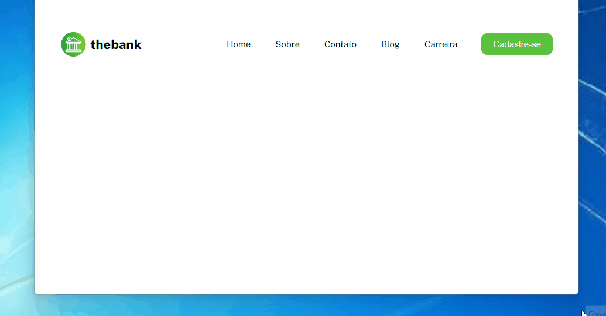

# Menu Responsivo com Flexbox

Este projeto apresenta um menu responsivo criado com Flexbox para garantir uma experiência de usuário consistente em diferentes dispositivos. Utiliza-se HTML e CSS, aproveitando as capacidades do Flexbox para construir um menu que se ajusta dinamicamente à largura da tela.

## Arquivos do Projeto

- `responsive.css`: Arquivo CSS com estilos específicos para tornar o menu responsivo em dispositivos menores.
- `style.css`: Arquivo CSS principal que define o estilo base do menu e dos elementos.
- `variables.css`: Arquivo CSS contendo variáveis de cores e configurações utilizadas no projeto.

### Responsividade

O arquivo `responsive.css` contém consultas de mídia (`@media`) para telas menores, adaptando o layout do menu para larguras até 798px. Algumas mudanças incluem:

- Alteração da direção do Flexbox para coluna (`flex-direction: column`) na classe `.header`.
- Ajustes no tamanho da fonte e padding dos itens do menu e botão para melhor adequação em telas menores.

### Utilização de Flexbox

O arquivo `style.css` utiliza propriedades do Flexbox para criar a estrutura do menu:

```css
.header {
    display: flex;
    justify-content: end;
    align-items: center;
    /* ... */
}

.menu {
    display: flex;
    /* ... */
}

/* ... */
```

O uso das propriedades do Flexbox, como `display: flex`, `justify-content` e `align-items`, permite a criação de um layout responsivo e alinhado dos elementos do menu.

### Estilo e Variáveis CSS
O arquivo `variables.css` centraliza as variáveis de cores e configurações usadas em todo o projeto, promovendo uma fácil personalização e manutenção do estilo.
As cores foram definidas como variáveis para garantir consistência e facilidade de modificação.

### Como Utilizar
Baixe ou clone este repositório.
Abra os arquivos HTML e CSS em seu editor de código preferido para visualizar e modificar conforme necessário.
Execute o arquivo HTML em um navegador para ver o menu responsivo em ação.

### Preview


## Deploy
[Deploy do Projeto](https://als-samara.github.io/menu-responsivo-com-flexbox/)

### Contatos
[](mailto:samaraalmeida379@gmail.com)<br>
[](https://www.linkedin.com/in/samara-almeida-als/)
